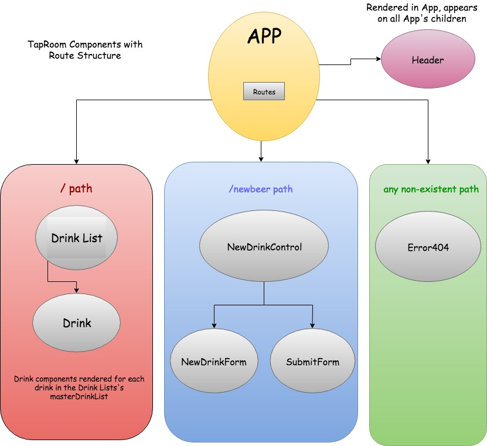

### _Tap Room React_
### Version 1.0
#### By: Jim Palowski
#### Date: 29 June 2018

##### Description
_This web application allows users to create a drink for a tap room_

##### Setup/Installation Requirements
* React
* Javascript
* Bootstrap
* HTML
* CSS
* NPM

##### Known Bugs
_So far there are no bugs_

#### Support and contact details
_If you run into a problem, contact me at palowskijim@gmail.com_

#### Specs
- This web application has the following functionalities:
  * Ability to create a drink
  * Drink List components to list

### License
* This program is free software: you can redistribute it and/or modify
* it under the terms of the GNU General Public License as published by
* the Free Software Foundation, either version 3 of the License, or
* (at your option) any later version.
*
* This program is distributed in the hope that it will be useful,
* but WITHOUT ANY WARRANTY; without even the implied warranty of
* MERCHANTABILITY or FITNESS FOR A PARTICULAR PURPOSE.  See the
* GNU General Public License for more details.
*
* You should have received a copy of the GNU General Public License
* along with this program.  If not, see <http://www.gnu.org/licenses/>.
* Copyright (c) 2018 _jim palowski@epicodus_

## Diagram

####
